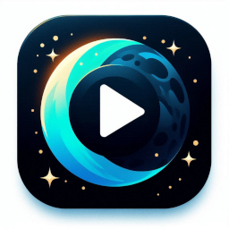

[](https://central.sonatype.com/artifact/io.github.darkryh.moongetter/moongetter-core/2.0.0-alpha01)
# MoonGetter for Kotlin

[](https://play.google.com/store/apps/details?id=com.ead.project.moongetter)
[](https://play.google.com/store/apps/details?id=com.ead.project.moongetter)

**MoonGetter** MoonGetter is a robust, Kotlin-first library engineered for seamless stream extraction and video hosting download logic. It offers comprehensive support for Android and is now fully Kotlin Multiplatform (KMP) ready, featuring flexible custom server integration.

---

## ✅ Features

-   **Custom Server Integration** — Easily build and integrate your own streaming providers.
-   **Coroutine-based Architecture** — Async-first design for highly scalable extraction logic.
-   **Transparent HTTP Client Injection** — Works seamlessly with both OkHttp and Ktor.
-   **Custom Error Types** — Intuitive error handling via `InvalidServerException` and descriptive `Error` enums.
-   **Flexible Cookie Management** — Automatic for OkHttp, configurable for Ktor.

---

## 🔄 Compatibility Table

| Feature                | Android |    JVM     | Kotlin Multiplatform |
| :--------------------- | :-----: |:----------:| :------------------: |
| Core Library           |   ✅    |     ✅      |          ✅          |
| Robot Servers API      |   ✅    | ⏳(desktop) |    ⏳ (Planned)      |
| Server Implementations |   ✅    |     ✅      |          ✅          |

> ✅ = Supported / ⏳ = In development / JVM refers to non-Android Kotlin projects.

---

## 🌐 Supported Servers (Core)

> ✅ Actively maintained / 💥 Deprecated

-   ✅ Google Drive
-   ✅ Mediafire
-   ✅ Streamtape
-   ✅ PixelDrain
-   ✅ Okru
-   ✅ StreamWish
-   💥 Voe *(Deprecated)*
-   ✅ Senvid
-   ✅ Vihide
-   ✅ Hexload
-   ✅ YourUpload
-   ✅ Facebook
-   ✅ XTwitter
-   ✅ LuluStream
-   ✅ Mp4Upload
-   ✅ Uqload
-   ✅ Mixdrop
-   ✅ Doodstream
-   ✅ Vidguard
-   ✅ Filemoon
-   ✅ VK

---

## 🤖 Robot Servers *(Optional)*

> These require the `moongetter-core-robot` module and a platform-specific Robot API.

-   💥 Fireload *(Deprecated)*
-   ✅ 1CloudFile

**Coming Soon:** GoodStream, Gofile, Abyss

---

## ☕ Installation (Gradle)

```kotlin
// For stable releases, use Maven Central
repositories {
    mavenCentral()
}
```
## Kotlin Multiplatform Project Dependencies (MoonGetter Modules Only)

This section outlines the `dependencies` block specifically for integrating **MoonGetter modules** within a **Kotlin Multiplatform (KMP)** project structure. It focuses solely on MoonGetter-related dependencies, showing their placement for common shared code, Android-specific configurations, and iOS (Darwin) targets.

```kotlin
dependencies {
    // --- Common Main (Shared KMP Logic) ---
    commonMain.dependencies {
        implementation("io.github.darkryh.moongetter:moongetter-core:2.0.0-alpha01")
        implementation("io.github.darkryh.moongetter:moongetter-client-ktor:2.0.0-alpha01")
        implementation("io.github.darkryh.moongetter:moongetter-server-bundle:2.0.0-alpha01")
        implementation("io.github.darkryh.moongetter:moongetter-core-robot:2.0.0-alpha01")
        implementation("io.github.darkryh.moongetter:moongetter-server-robot-bundle:2.0.0-alpha01")
        // Optional: Individual server modules (instead of bundles)
        // implementation("io.github.darkryh.moongetter:moongetter-mp4upload:2.0.0-alpha01")
    }

    // --- Android Specific ---
    androidMain.dependencies {
        // Choose ONE HTTP client:
        implementation("io.github.darkryh.moongetter:moongetter-client-okhttp:2.0.0-alpha01") // Option 1: MoonGetter OkHttp Client
        // OR
        // implementation("io.ktor:ktor-client-okhttp:2.3.12") // Option 2: Ktor with OkHttp engine

        implementation("io.github.darkryh.moongetter:moongetter-client-cookie-java-net:2.0.0-alpha01") // Required: Cookie management if using ktor
        implementation("io.github.darkryh.moongetter:moongetter-client-trustmanager-java-net:2.0.0-alpha01") // Required: Trust management if using ktor
        implementation("io.github.darkryh.moongetter:moongetter-android-robot:2.0.0-alpha01") // Android Robot APIs
    }

    // --- iOS Specific ---
    iosMain.dependencies {
        // REQUIRED: Ktor's Darwin engine for network requests on iOS.
        implementation("io.ktor:ktor-client-darwin:2.3.12")
    }

    // --- Desktop (JVM) Specific ---
    desktopMain.dependencies {
        // Choose ONE HTTP client:
        implementation("io.ktor:ktor-client-cio:2.3.12") // Option 1: Ktor with CIO engine
        // OR
        // implementation("io.github.darkryh.moongetter:moongetter-client-okhttp:2.0.0-alpha01") // Option 2: MoonGetter OkHttp Client

        implementation("io.github.darkryh.moongetter:moongetter-client-cookie-java-net:2.0.0-alpha01") // Required: Cookie management if using ktor
        implementation("io.github.darkryh.moongetter:moongetter-client-trustmanager-java-net:2.0.0-alpha01") // Required: Trust management if using ktor
    }
}
```

## Java/Kotlin JVM Project Dependencies (MoonGetter Integration Example)

This section outlines the `dependencies` block for integrating **MoonGetter modules** into a standard **Java or Kotlin JVM project**. This includes typical Android applications or standalone desktop JVM applications that **do not use Kotlin Multiplatform**.

```kotlin
dependencies {
    // --- Core & Server Support ---
    implementation("io.github.darkryh.moongetter:moongetter-core:2.0.0-alpha01")
    implementation("io.github.darkryh.moongetter:moongetter-server-bundle:2.0.0-alpha01")
    implementation("io.github.darkryh.moongetter:moongetter-core-robot:2.0.0-alpha01")
    implementation("io.github.darkryh.moongetter:moongetter-server-robot-bundle:2.0.0-alpha01")
    // Optional: Individual server modules
    // implementation("io.github.darkryh.moongetter:moongetter-mp4upload:2.0.0-alpha01")

    // --- HTTP Client & Utilities ---
    // Choose your client:
    implementation("io.github.darkryh.moongetter:moongetter-client-okhttp:2.0.0-alpha01") // Option 1: OkHttp (recommended)
    // OR
    // implementation("io.github.darkryh.moongetter:moongetter-client-ktor:2.0.0-alpha01") // Option 2: Ktor
    // + Ktor engine (e.g., "io.ktor:ktor-client-okhttp:2.3.12" or "io.ktor:ktor-client-cio:2.3.12")

    implementation("io.github.darkryh.moongetter:moongetter-client-cookie-java-net:2.0.0-alpha01") // Required: Cookie management if using ktor
    implementation("io.github.darkryh.moongetter:moongetter-client-trustmanager-java-net:2.0.0-alpha01") // Required: Trust management if using ktor

    // Android-specific Robot (only for Android projects)
    implementation("io.github.darkryh.moongetter:moongetter-android-robot:2.0.0-alpha01")
}
```

---

## 🧐 Client & Cookie Management Integration

| Client Library     | Module                                       | Cookie Management                 | KMP Support        |
|-------------------|----------------------------------------------|-----------------------------------|--------------------|
| **OkHttp**         | `moongetter-client-okhttp`                   | ✅ Built-in                        | ⏳ Not Supported    |
| **Ktor**           | `moongetter-client-ktor`                     | ⚠️ Manual setup required           | ✅ Experimental     |
| **JavaNetCookieManager** | `moongetter-client-cookie-java-net`    | ✅ (Only for Ktor, optional)       | ⏳ Not Supported    |

> ✅ = Supported / ⚠️ = Manual setup / ⏳ = Coming soon

**Note**:
- **OkHttp** has **built-in cookie support**, no setup needed.
- **Ktor** requires you to explicitly inject cookie management (e.g., `JavaNetCookieManagement`).
  Example Initialization:
```kotlin
MoonGetter.start(
    MoonFactory
        .Builder()
        .setClient(
            client = KtorMoonClient(
                engineFactory = httpClientEngineFactory,
                cookieManagement = cookieManagement,
                trustManager = trustManager
            )
        )
        .setTimeout(timeoutMillis = 12000)
        .setEngine(engine = engine)
)
```

Example with Ktor:
```kotlin
MoonFactory.Builder()
    .setClient(
        KtorMoonClient(
            engineFactory = CIO, //on iOS Darwin
            cookieManagement = JavaNetCookieManagement(), //on iOS MoonCookie.Management.newEmptyFactory()
            trustManager = JavaMoonTrustManager // on iOS MoonTrust.Manager.newEmptyFactory()
        )
    )
```

Example with OkHttp:
```kotlin
MoonFactory.Builder()
    .setClient(
        OkHttpClient
    )
```

---

## 🚀 Example Usage

### ViewModel with coroutine logic:
```kotlin
class MyViewModel : ViewModel() {

    private val engine = Engine.Builder()
        .onCore(
            engines = arrayOf(
                Mp4UploadFactory,
                FilemoonFactory,
                StreamtapeFactory,
                StreamwishFactory,
                // CustomServerFactory (recommended to use `object`)
            )
        )
        .build()

    fun getMediaStreams(url: String) = viewModelScope.launch(Dispatchers.IO) {
        try {
            MoonGetter.start(
                MoonFactory
                    .Builder()
                    .setClient(
                        KtorMoonClient(
                            engineFactory = CIO,//jvm other option Okhttp //on iOS Darwin
                            cookieManagement = JavaNetCookieManagement(), //on iOS MoonCookie.Management.newEmptyFactory()
                            trustManager = JavaMoonTrustManager // on iOS MoonTrust.Manager.newEmptyFactory()
                        )
                    )
                    .setTimeout(8000)
                    .setEngine(engine)
            )
                
                
            val server : Server = MoonGetter.get(url) // returns server

            val streams = server?.videos
        } catch (e: InvalidServerException) {
            Log.e("MoonGetter", "Invalid: ${e.message}", e)
        } catch (e: Exception) {
            e.printStackTrace()
        }
    }
}
```

---

## 🛠 Add Your Own Custom Server

### Custom Server Class
```kotlin
class CustomServer(
    url: String,
    client: MoonClient,
    headers: HashMap<String, String>,
    configData: Configuration.Data
) : Server(url, client, headers, configData) {

    private val urlRegex =  """https://custom\.domain\.com/aqua/sv\?url=([^&]+)""".toRegex()

    override var url: String = urlRegex.find(url)?.groupValues?.get(1)
        ?: throw InvalidServerException(
            Resources.invalidProcessInExpectedUrlEntry(name),
            Error.INVALID_PROCESS_IN_EXPECTED_URL_ENTRY
        )

    override suspend fun onExtract(): List<Video> {
        val response = client.GET()

        if (!response.isSuccess) throw InvalidServerException(
            Resources.unsuccessfulResponse(name),
            Error.UNSUCCESSFUL_RESPONSE,
            response.statusCode
        )

        return listOf(
            Video(
                quality = DEFAULT,
                url = PatternManager.singleMatch(
                    string = response.body.asString(),
                    regex = "<source src=\"(.*?)\""
                ) ?: throw InvalidServerException(
                    Resources.expectedResponseNotFound(name),
                    Error.EXPECTED_RESPONSE_NOT_FOUND
                )
            )
        )
    }
}
```

### Custom Server Factory
```kotlin
object CustomServerFactory : Server.Factory {
    override val serverName: String = "MyCustomServer" // Must match the serverName in CustomServer
    override val pattern: String = """https://custom\.domain\.com/aqua/sv\?url=([^&]+)""" // Your regex pattern for URLs this server handles
    
    //instance function since kmp doesnt support reflection
    override fun create(
        url: String,
        headers: HashMap<String, String>,
        configData: Configuration.Data,
        client: MoonClient
    ): Server = CustomServer(
        url = url,
        client = client,
        headers = headers,
        configData = configData
    )
}
```

---

## 🧪 MoonGetter – Server Retrieval API

The `MoonGetter` object provides several methods to resolve [Server] instances from URLs.  
Before using any of these functions, you **must initialize** the library with [`start(factory: Factory.Builder)`](#).  
If it is not initialized, the methods will throw [InvalidServerException] with error [Error.CONFIG_NOT_INITIALIZED].

---

### 🔹 `suspend fun get(url: String): Server`
Resolves a single [Server] for the given URL.  
Unlike the `getOrNull` variant, this method **throws an exception** if resolution fails.

- **Parameters**
    - `url: String` → Candidate URL to resolve into a server.

- **Returns**
    - [Server] → A non-null instance corresponding to the provided URL.

- **Throws**
    - [InvalidServerException] if the factory is not initialized.
    - [RuntimeException] for unexpected runtime errors.

---

### 🔹 `suspend fun getOrNull(url: String): Server?`
Safe variant of [`get(url)`](#suspend-fun-geturl-string-server).  
Instead of throwing when no server can be resolved, it returns `null`.  
⚠️ **Special case**: if the library has not been initialized, [InvalidServerException] is re-thrown to signal improper API usage.

- **Parameters**
    - `url: String`

- **Returns**
    - [Server]? → A resolved instance if successful, or `null` if none could be found.

- **Throws**
    - [InvalidServerException] when the factory has not been initialized.

---

### 🔹 `suspend fun get(urls: List<String>): List<Server>`
Resolves multiple [Server] instances in one call, keeping the same order as the input URLs.  
All returned elements are **non-null**.

- **Parameters**
    - `urls: List<String>` → List of candidate URLs.

- **Returns**
    - `List<Server>` → A list of resolved server instances, one for each input URL.

- **Throws**
    - [InvalidServerException] if the factory is not initialized.
    - [RuntimeException] for unexpected runtime errors.

---

### 🔹 `suspend fun getUntilFindResource(urls: List<String>): Server`
Sequentially checks a list of URLs until the **first valid [Server]** is found.  
If no valid server is found, it throws an exception.

- **Parameters**
    - `urls: List<String>`

- **Returns**
    - [Server] → The first successfully resolved server.

- **Throws**
    - [InvalidServerException] if the factory is not initialized or no valid server is found.
    - [RuntimeException] for unexpected runtime errors.

---

### 🔹 `suspend fun getUntilFindResourceOrNull(urls: List<String>): Server?`
Safe variant of [`getUntilFindResource(urls)`](#suspend-fun-getuntilfindresourceurls-liststring-server).  
Instead of throwing when no valid server is found, it returns `null`.  
⚠️ As with `getOrNull`, [InvalidServerException] is still thrown if the factory has not been initialized.

- **Parameters**
    - `urls: List<String>`

- **Returns**
    - [Server]? → The first valid server found, or `null` if none could be resolved.

- **Throws**
    - [InvalidServerException] if the factory has not been initialized.

---

📌 **Key Notes**:
- `get` variants always return **non-null** and assume successful resolution.
- `getOrNull` variants return **nullable** for resolution failures, but still throw if the factory was not initialized.
- `get(urls: List<String>)` always returns a **non-null list with non-null elements**.

---

## 🤝 Want to Collaborate?
If you'd like to contribute or propose a new feature, feel free to reach out via [X / Twitter](https://x.com/Darkryh) @Darkryh or open a PR/request.

---

MoonGetter is in active development to expand KMP support. Swift/iOS support is **coming soon**.
